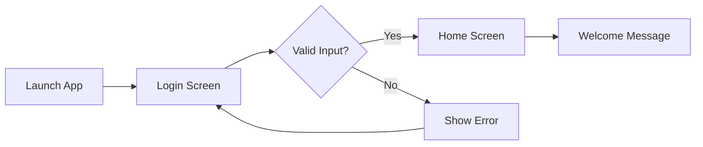

<div align="center">

# 🚀 Flutter Week 1 – Login UI App

### *A Modern, Clean Login Interface Built with Flutter*

[](https://flutter.dev)
[](https://dart.dev)
[](https://material.io)
[](https://opensource.org/licenses/MIT)

**A comprehensive beginner-friendly Flutter project demonstrating UI fundamentals, form validation, and navigation patterns.**

[View Demo](#-screenshots) · [Report Bug](https://github.com/your-username/flutter-week1-login-ui/issues) · [Request Feature](https://github.com/your-username/flutter-week1-login-ui/issues)

</div>

---

## 📋 Table of Contents

<details>
<summary>Click to expand</summary>

- [About The Project](#-about-the-project)
- [Screenshots](#-screenshots)
- [Features](#-features)
- [Learning Objectives](#-learning-objectives)
- [Tech Stack](#-tech-stack)
- [Project Structure](#-project-structure)
- [Getting Started](#-getting-started)
  - [Prerequisites](#prerequisites)
  - [Installation](#installation)
- [Usage](#-usage)
- [Roadmap](#-roadmap)
- [Contributing](#-contributing)
- [License](#-license)
- [Contact](#-contact)
- [Acknowledgments](#-acknowledgments)

</details>

---

## 🎯 About The Project

<div align="center">
  
  
  
</div>

<br>

This project is part of **Week 1: Basic Flutter Development and UI Building** course. It's designed to provide hands-on experience with Flutter's core concepts while building a production-ready login interface.

### 🎓 What Makes This Project Special?

- **📱 Real-World Application** - Implements industry-standard login UI patterns
- **✨ Clean Code** - Well-structured, documented, and maintainable
- **🎨 Modern Design** - Follows Material Design 3 guidelines
- **🔒 Secure Patterns** - Password visibility toggle and input validation
- **📚 Educational** - Extensively commented for learning purposes

### Built With

This project leverages the power of:

- **Flutter** - Google's UI toolkit for building natively compiled applications
- **Dart** - Client-optimized programming language
- **Material Design 3** - Latest design system from Google

---

## 📸 Screenshots

<div align="center">

### Light Mode Interface

<table>
  <tr>
    <td align="center">
      
      <br><b>Login Screen</b>
    </td>
    <td align="center">
      
      <br><b>Form Validation</b>
    </td>
    <td align="center">
      
      <br><b>Home Screen</b>
    </td>
  </tr>
</table>

### UI Flow Demonstration



</div>

> 💡 **Tip:** Add your actual screenshots to the `screenshots/` folder for better documentation.

---

## ✨ Features

<table>
  <tr>
    <td width="50%">
      
### 🔐 Authentication UI
- ✅ **Email Input Field**  
  Validates email format using RegEx pattern
  
- ✅ **Password Input Field**  
  Secure input with show/hide toggle
  
- ✅ **Forgot Password Link**  
  Interactive text button (UI ready for backend)
  
- ✅ **Login Button**  
  Animated button with loading states

    </td>
    <td width="50%">
      
### ✅ Form Validation
- ✅ **Real-time Validation**  
  Instant feedback on user input
  
- ✅ **Email Format Check**  
  RFC 5322 compliant validation
  
- ✅ **Required Fields**  
  Prevents empty submissions
  
- ✅ **Error Messages**  
  User-friendly validation feedback

    </td>
  </tr>
  <tr>
    <td width="50%">
      
### 🏠 Home Screen
- ✅ **Welcome Message**  
  Personalized greeting after login
  
- ✅ **User Email Display**  
  Shows logged-in user information
  
- ✅ **Navigation Handling**  
  Proper back button behavior

    </td>
    <td width="50%">
      
### 🎨 User Experience
- ✅ **Material Design 3**  
  Modern, clean interface
  
- ✅ **Responsive Layout**  
  Works on all screen sizes
  
- ✅ **Smooth Animations**  
  Polished transitions
  
- ✅ **Accessibility**  
  Screen reader compatible

    </td>
  </tr>
</table>

---

## 📚 Learning Objectives

<div align="center">

### Core Competencies Developed

</div>

| # | Objective | Status |
|---|-----------|--------|
| 1 | Understand Flutter project architecture and file structure | ✅ Complete |
| 2 | Build responsive UIs using Flutter widgets | ✅ Complete |
| 3 | Master core widgets: `Column`, `Row`, `Container`, `TextField`, `ElevatedButton` | ✅ Complete |
| 4 | Implement form validation logic with error handling | ✅ Complete |
| 5 | Manage state effectively with `StatefulWidget` | ✅ Complete |
| 6 | Navigate between screens using `Navigator` | ✅ Complete |
| 7 | Handle user input and events properly | ✅ Complete |
| 8 | Apply Material Design 3 principles | ✅ Complete |

### 🎯 Skills Matrix

```
Flutter Basics        ████████████████████ 100%
Widget Composition    ████████████████████ 100%
Form Validation       ████████████████████ 100%
State Management      ███████████████░░░░░  75%
Navigation            ████████████████████ 100%
UI/UX Design          ███████████████████░  95%
```

---

## 🛠 Tech Stack

<div align="center">

### Core Technologies

| Technology | Version | Purpose |
|------------|---------|---------|
|  | 3.24+ | UI Framework |
|  | 3.5+ | Programming Language |
|  | 3.0 | UI/UX Guidelines |

</div>

### 📦 Dependencies

```yaml
dependencies:
  flutter:
    sdk: flutter
  cupertino_icons: ^1.0.8  # iOS-style icons
  
dev_dependencies:
  flutter_test:
    sdk: flutter
  flutter_lints: ^4.0.0    # Recommended lints
```

### 🔧 Development Tools

- **IDE:** Android Studio / VS Code with Flutter extension
- **Version Control:** Git & GitHub
- **Testing:** Flutter DevTools
- **Emulator:** Android/iOS simulators or physical devices

---

## 📂 Project Structure

```
flutter-week1-login-app/
│
├── 📱 lib/                          # Application source code
│   ├── main.dart                    # App entry point & theme config
│   ├── 📄 screens/
│   │   ├── login_screen.dart        # Login UI & validation logic
│   │   └── home_screen.dart         # Post-login home screen
│   ├── 🧩 widgets/
│   │   ├── custom_text_field.dart   # Reusable text input widget
│   │   └── custom_button.dart       # Styled button component
│   ├── 🎨 constants/
│   │   ├── colors.dart              # App color palette
│   │   └── text_styles.dart         # Typography definitions
│   └── 🛠 utils/
│       └── validators.dart          # Input validation functions
│
├── 🖼 assets/
│   ├── images/                      # App images & illustrations
│   │   └── logo.png
│   └── icons/                       # Custom icon assets
│
├── 📸 screenshots/                   # Documentation screenshots
│   ├── login.png
│   ├── validation.png
│   └── home.png
│
├── 🤖 android/                       # Android platform files
├── 🍎 ios/                          # iOS platform files
├── 🌐 web/                          # Web platform files
│
├── 📋 pubspec.yaml                   # Project dependencies & assets
├── 📋 analysis_options.yaml          # Dart linting configuration
├── 📖 README.md                      # Project documentation
├── 📄 LICENSE                        # MIT License
└── 🚫 .gitignore                    # Git ignore rules
```

<details>
<summary>📖 File Descriptions</summary>

- **main.dart** - Application entry point with MaterialApp configuration
- **login_screen.dart** - Complete login interface with form validation
- **home_screen.dart** - Welcome screen displayed after successful login
- **validators.dart** - Email and password validation utility functions
- **colors.dart** - Centralized color scheme for consistent theming
- **text_styles.dart** - Typography definitions for uniform text styling

</details>

---

## 🚀 Getting Started

Follow these steps to get the project running on your local machine.

### Prerequisites

Before you begin, ensure you have the following installed:

- ✅ **Flutter SDK** (3.0 or higher)  
  ```bash
  flutter --version
  ```
  
- ✅ **Dart SDK** (included with Flutter)
  
- ✅ **Android Studio** or **VS Code**  
  With Flutter and Dart plugins installed
  
- ✅ **Git** for version control  
  ```bash
  git --version
  ```

### Installation

#### Step 1: Clone the Repository

```bash
# Using HTTPS
git clone https://github.com/your-username/flutter-week1-login-ui.git

# OR using SSH
git clone git@github.com:your-username/flutter-week1-login-ui.git
```

#### Step 2: Navigate to Project Directory

```bash
cd flutter-week1-login-ui
```

#### Step 3: Install Dependencies

```bash
flutter pub get
```

#### Step 4: Verify Flutter Installation

```bash
flutter doctor -v
```

Ensure all required components show a checkmark ✓

#### Step 5: Run the Application

```bash
# Run on connected device/emulator
flutter run

# Run on specific device
flutter devices  # List all available devices
flutter run -d <device_id>
```

### 🎉 Success!

Your app should now be running. You'll see the login screen on your device/emulator.

---

## 💻 Usage

### Running on Different Platforms

<table>
  <tr>
    <th>Platform</th>
    <th>Command</th>
    <th>Requirements</th>
  </tr>
  <tr>
    <td>🤖 Android</td>
    <td><code>flutter run</code></td>
    <td>Android Studio, Android SDK</td>
  </tr>
  <tr>
    <td>🍎 iOS</td>
    <td><code>flutter run</code></td>
    <td>Xcode, macOS</td>
  </tr>
  <tr>
    <td>🌐 Web</td>
    <td><code>flutter run -d chrome</code></td>
    <td>Chrome browser</td>
  </tr>
  <tr>
    <td>🪟 Windows</td>
    <td><code>flutter run -d windows</code></td>
    <td>Windows 10+, Visual Studio</td>
  </tr>
  <tr>
    <td>🍏 macOS</td>
    <td><code>flutter run -d macos</code></td>
    <td>macOS, Xcode</td>
  </tr>
  <tr>
    <td>🐧 Linux</td>
    <td><code>flutter run -d linux</code></td>
    <td>Linux, GTK+</td>
  </tr>
</table>

### 🧪 Testing Credentials

For development and testing purposes:

| Field | Test Value | Notes |
|-------|-----------|-------|
| **Email** | `test@example.com` | Any valid email format |
| **Email** | `demo@flutter.dev` | Alternative test email |
| **Password** | `password123` | Any non-empty string |
| **Password** | `Test@1234` | With special characters |

> ⚠️ **Important:** This is a UI-only implementation. No actual authentication backend is connected.

### 📱 Development Commands

```bash
# Hot reload (during development)
r

# Hot restart
R

# Open DevTools
flutter pub global activate devtools
flutter pub global run devtools

# Build APK
flutter build apk --release

# Build iOS
flutter build ios --release

# Run tests
flutter test

# Analyze code
flutter analyze
```

---

## 🗺 Roadmap

### ✅ Completed (Week 1)

- [x] Basic login UI design
- [x] Email and password validation
- [x] Navigation to home screen
- [x] Password visibility toggle
- [x] Form error handling

### 🔄 In Progress (Week 2)

- [ ] Backend integration (Firebase Auth)
- [ ] Registration screen
- [ ] Password recovery flow

### 📅 Future Enhancements

<details>
<summary>Click to view planned features</summary>

#### Authentication & Security
- [ ] Firebase Authentication integration
- [ ] JWT token management
- [ ] Biometric authentication (fingerprint/face ID)
- [ ] Two-factor authentication (2FA)
- [ ] Session management & auto-logout

#### UI/UX Improvements
- [ ] Dark mode support
- [ ] Onboarding screens
- [ ] Loading animations & skeletons
- [ ] Custom splash screen
- [ ] Error screen with retry option
- [ ] Success/failure snackbars

#### Features
- [ ] "Remember Me" checkbox with secure storage
- [ ] Social media login (Google, Facebook, Apple)
- [ ] Multi-language support (i18n)
- [ ] User profile management
- [ ] Password strength indicator
- [ ] Email verification flow

#### Code Quality
- [ ] Unit tests (90%+ coverage)
- [ ] Widget tests
- [ ] Integration tests
- [ ] CI/CD pipeline (GitHub Actions)
- [ ] Code documentation (DartDoc)
- [ ] Performance optimization

#### DevOps
- [ ] Automated testing
- [ ] Crashlytics integration
- [ ] Analytics (Firebase/Google Analytics)
- [ ] App Store & Play Store deployment

</details>

---

## 🤝 Contributing

Contributions make the open-source community an amazing place to learn, inspire, and create. Any contributions you make are **greatly appreciated**!

### How to Contribute

1. **Fork the Project**
   ```bash
   # Click the 'Fork' button at the top right of this page
   ```

2. **Create your Feature Branch**
   ```bash
   git checkout -b feature/AmazingFeature
   ```

3. **Commit your Changes**
   ```bash
   git commit -m 'Add some AmazingFeature'
   ```

4. **Push to the Branch**
   ```bash
   git push origin feature/AmazingFeature
   ```

5. **Open a Pull Request**
   - Go to your forked repository on GitHub
   - Click "New Pull Request"
   - Provide a clear description of your changes

### Contribution Guidelines

- Write clean, maintainable code
- Follow Dart style guide
- Add comments for complex logic
- Update documentation as needed
- Test your changes thoroughly
- Keep commits atomic and well-described

### 🐛 Found a Bug?

If you find a bug, please [open an issue](https://github.com/your-username/flutter-week1-login-ui/issues/new) with:
- Bug description
- Steps to reproduce
- Expected vs actual behavior
- Screenshots (if applicable)
- Device/platform information

---

## 📄 License

Distributed under the **MIT License**. See [`LICENSE`](LICENSE) file for more information.

```
MIT License

Copyright (c) 2024 Your Name

Permission is hereby granted, free of charge, to any person obtaining a copy
of this software and associated documentation files...
```

---

## 📞 Contact

<div align="center">

### 👨‍💻 Your Name

[](https://github.com/your-username)
[](https://linkedin.com/in/your-profile)
[](mailto:your.email@example.com)
[](https://your-portfolio.com)

**Project Link:** [https://github.com/your-username/flutter-week1-login-ui](https://github.com/your-username/flutter-week1-login-ui)

</div>

---

## 🙏 Acknowledgments

Special thanks to these amazing resources:

- 📚 [Flutter Documentation](https://docs.flutter.dev/) - Official Flutter docs
- 🎨 [Material Design 3](https://m3.material.io/) - Design guidelines
- 💡 [Flutter Community](https://flutter.dev/community) - Helpful community
- 🎓 [Dart Language Tour](https://dart.dev/guides/language/language-tour) - Dart fundamentals
- 🚀 [Flutter Awesome](https://flutterawesome.com/) - Curated Flutter resources
- 📝 [Best README Template](https://github.com/othneildrew/Best-README-Template) - README inspiration
- 🎯 [Choose an Open Source License](https://choosealicense.com) - License guide
- 📊 [Shields.io](https://shields.io) - Badge generator

### 🌟 Inspiration

This project was inspired by:
- Modern mobile banking apps
- Google's Material Design case studies
- Flutter's official sample projects

---

<div align="center">

### ⭐ Star this repository if you found it helpful!

<a href="https://github.com/your-username/flutter-week1-login-ui/stargazers">
  
</a>
<a href="https://github.com/your-username/flutter-week1-login-ui/network/members">
  
</a>
<a href="https://github.com/your-username/flutter-week1-login-ui/watchers">
  
</a>

---

**Made with ❤️ and Flutter**

*Happy Coding! 🚀*

</div>
